# 🩺 CarePilot

**Çok dilli ve hafızalı, yapay zeka destekli sağlık turizmi hasta konsiyerj platformu.**

> YZTA (Yapay Zeka ve Teknoloji Akademisi) Bootcamp 2026 — **Grup 153**

[](https://carepilot-backend-production.up.railway.app/api/v1/health)
[](https://carepilot-backend-production.up.railway.app/docs)

- **Canlı API:** https://carepilot-backend-production.up.railway.app
- **Etkileşimli API dokümantasyonu:** https://carepilot-backend-production.up.railway.app/docs

---

## 👥 Takım

### Takım Üyeleri

| İsim | Rol | İletişim |
|---|---|---|
| **Can Çorapçıoğlu** | Scrum Master · Product Owner · Developer | [GitHub @cancrpcoglu](https://github.com/cancrpcoglu) |

> Akademi Danışmanı: **Hikmet Topak** · Grup: **153** · Bölüm: **Yapay Zeka ve Veri Bilimi**

---

## 🎯 Ürün

### Ürün İsmi
**CarePilot**

### Ürün Açıklaması
Türkiye, saç ekimi ve estetik cerrahide dünya lideri ülkelerden biridir; her yıl yüz binlerce yabancı hasta bu tedaviler için Türkiye'ye gelir. Ancak bu süreç hâlâ büyük ölçüde manuel ve dağınık yönetilir: dil bariyeri, WhatsApp üzerinden standart olmayan koordinasyon ve ameliyat sonrası takip kaybı.

CarePilot, hasta yolculuğunun başından sonuna kadar refakat eden **çok dilli ve hafızalı bir yapay zeka hasta konsiyerj agent'ı** sunar. Hasta kendi dilinde agent ile görüşür; agent **yapılandırılmış bir ön değerlendirme raporu** çıkarır; klinik bu raporu onaylar; agent ameliyat öncesi/sonrası süreci hafızasında tutarak hastayı yönlendirir.

### Ürün Özellikleri
- 🤖 **AI triage:** Hasta mesajından, Gemini 2.5 Flash + structured output ile yapılandırılmış ön değerlendirme (tedavi alanı, şikayetler, sağlık geçmişi, eksik bilgi, dil tespiti)
- 💬 **Hafızalı hasta sohbeti:** Hasta, kendine özel bir linkten yapay zeka asistanıyla kendi dilinde çok turlu sohbet eder (LangGraph + PostgreSQL hafıza); agent yeterli bilgiyi toplayınca otomatik olarak klinik onayına ön değerlendirme raporu üretir
- 🔗 **Self-servis davet linki + QR:** Klinik tek bir genel link/QR paylaşır; yeni hasta kendi ön kaydını yapıp AI ile sohbet eder, panelde otomatik hasta + rapor belirir (per-hasta link de mevcut)
- 🌍 **Çok dilli:** Hasta herhangi bir dilde yazar; agent dili tespit edip klinik için Türkçe özet üretir
- 🗂 **Hasta yönetimi:** Klinik hastayı düzenler, özel not tutar, siler (soft delete)
- 🔎 **Anlamsal rapor arama:** Klinik doğal dille arar (örn. "diyabetli estetik hastaları"); en alakalı raporlar Gemini embedding + pgvector kosinüs benzerliğiyle sıralanır
- 🏥 **Klinik paneli:** Hasta yönetimi, gelen ön değerlendirmeleri görüntüleme ve onaylama/reddetme
- 🧠 **Hafızalı yolculuk:** Konuşma ve yolculuk adımları PostgreSQL'de kalıcı tutulur
- 🔐 **Rol bazlı erişim:** JWT ile klinik yöneticisi ve hasta rolleri; klinikler arası veri izolasyonu

### Hedef Kitle
- **B2B:** Saç ekimi ve estetik cerrahi klinikleri (platformu white-label kullanır)
- **B2C:** Türkiye'de tedavi arayan yabancı hastalar (klinik üzerinden agent'a erişir)

### 📌 Product Backlog
Backlog ve sprint takibi bu repoda [**PRODUCT_BACKLOG.md**](./PRODUCT_BACKLOG.md) dosyasında yürütülmektedir. Toplam ~300 puanlık backlog 3 sprint'e (~100 puan/sprint) bölünmüştür.

---

## 🏗 Mimari

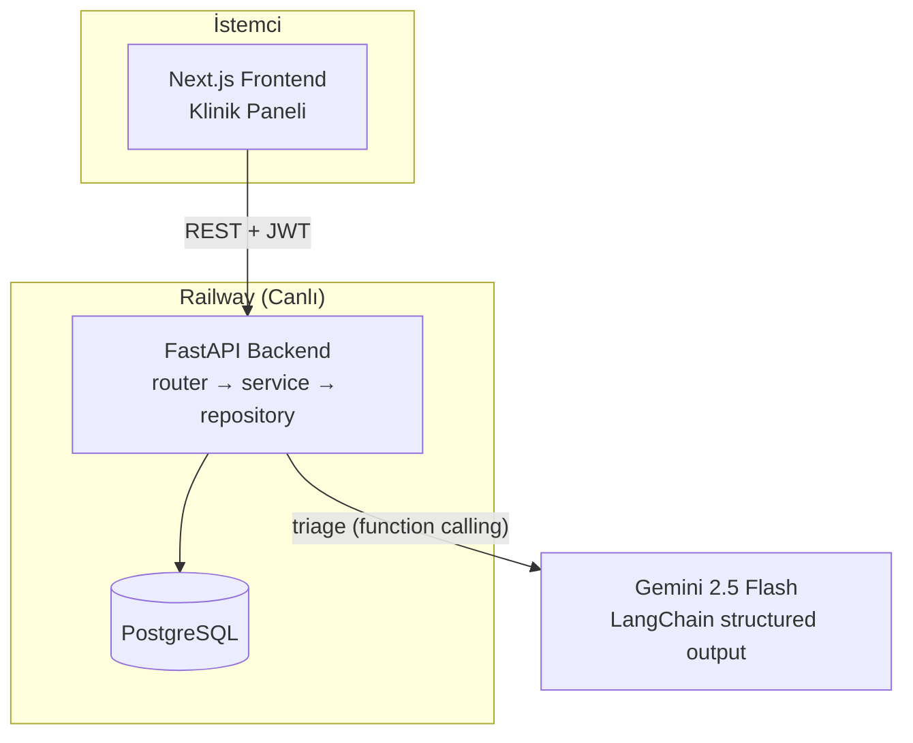

**Triage akışı (AI ön değerlendirme → klinik onayı):**

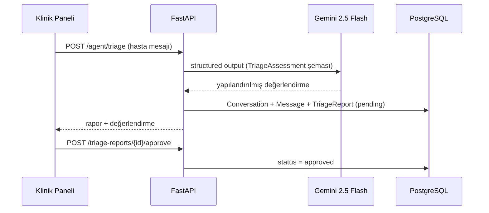

**Veritabanı şeması:**

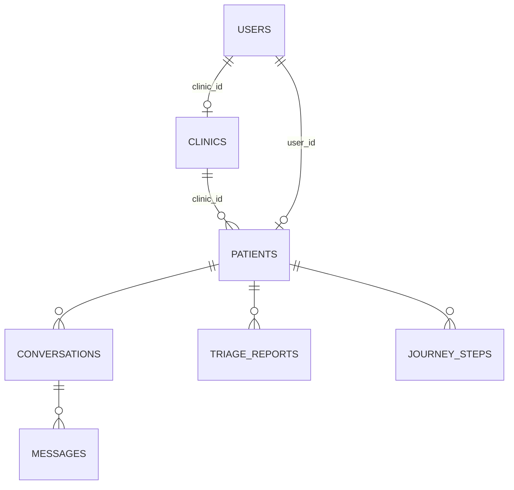

Backend, temiz mimari (clean architecture) ile katmanlıdır: **router → service → repository → model**. Her tablo `created_at`, `updated_at`, `is_deleted` (soft delete) kolonlarını taşır.

---

## 🧰 Teknoloji Yığını

| Katman | Teknoloji |
|---|---|
| Frontend | Next.js 16 (App Router), TypeScript, Tailwind CSS, React Query, Zod |
| Backend | FastAPI, async SQLAlchemy, Alembic |
| Veritabanı | PostgreSQL (+ pgvector) |
| Yapay Zeka | Gemini 2.5 Flash, LangChain + LangGraph (structured output, çok turlu hafızalı agent), gemini-embedding-001 + pgvector (anlamsal arama) |
| Kimlik Doğrulama | JWT (PyJWT + bcrypt) |
| Test & Lint | Pytest, ruff |
| CI/CD | GitHub Actions |
| Deploy | Railway (backend + PostgreSQL) |

---

## 🖼 Ürün Durumu (Ekran Görüntüleri)

| Açılış sayfası | Klinik paneli |
|---|---|
| 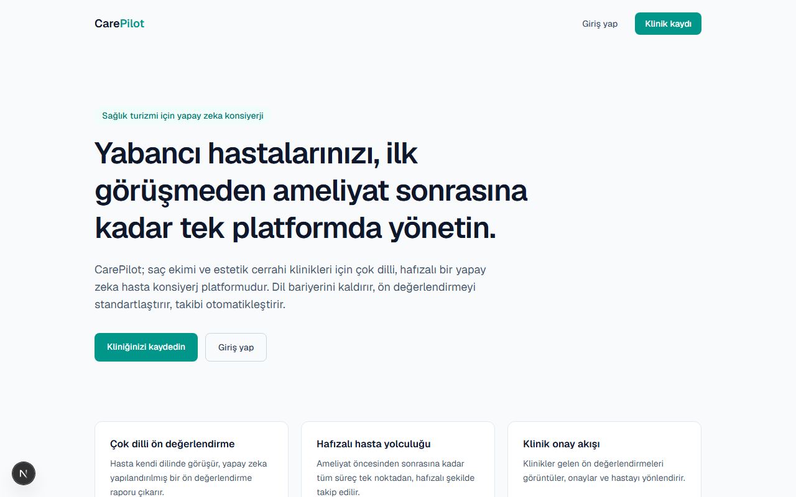 | 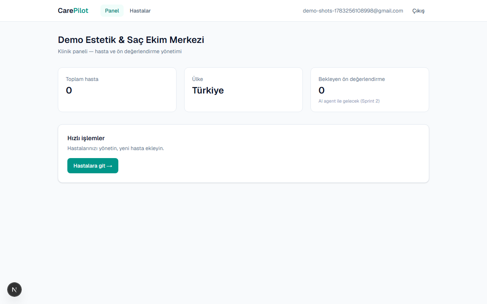 |

| Hasta yönetimi (çok dilli) | Canlı API dokümantasyonu |
|---|---|
| 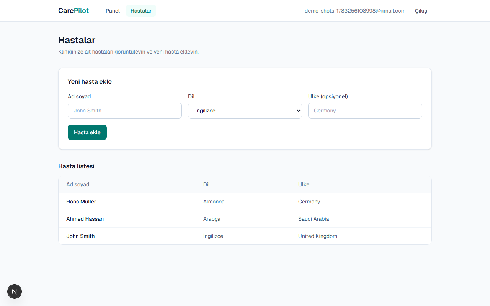 | 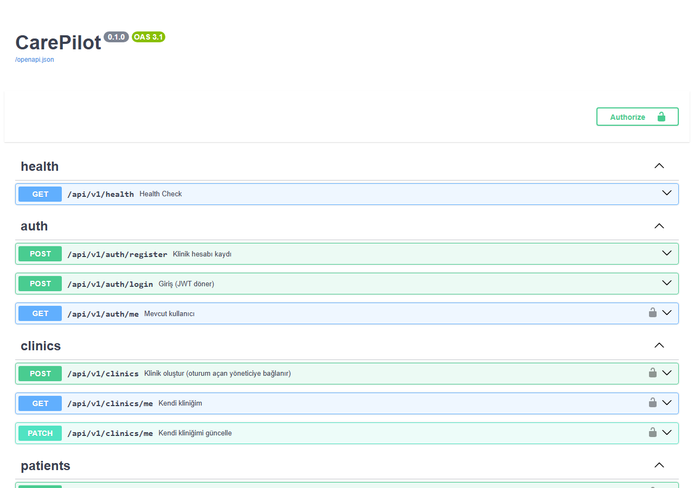 |

| Hasta AI sohbeti (hafızalı, çok dilli) | Hasta detayı + sohbet linki |
|---|---|
| 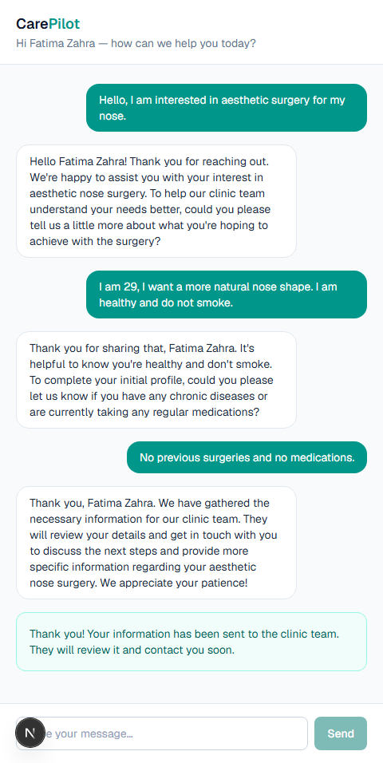 | 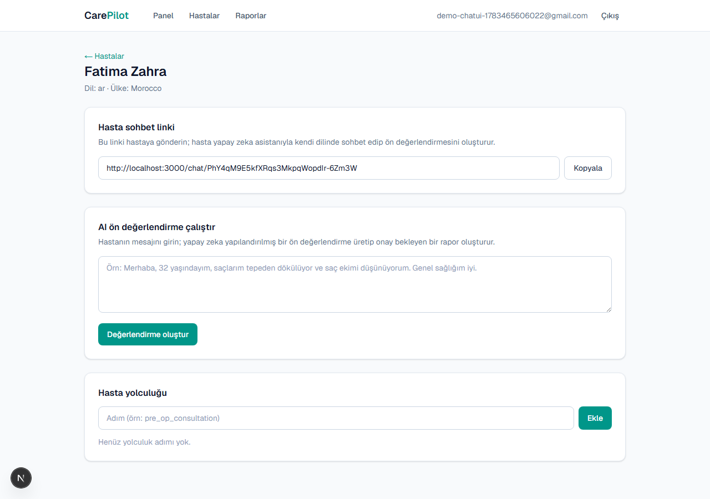 |

| Self-servis davet linki + QR (panel) | Hasta yönetimi (düzenle / not / sil) |
|---|---|
| 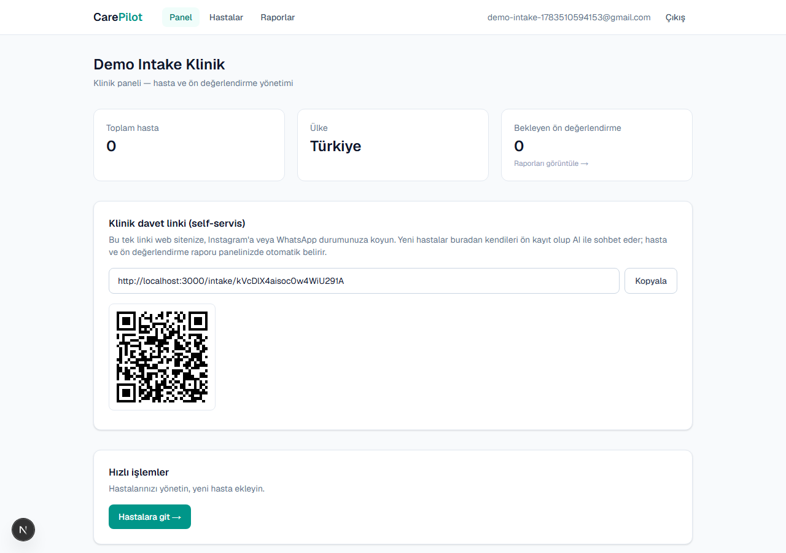 | 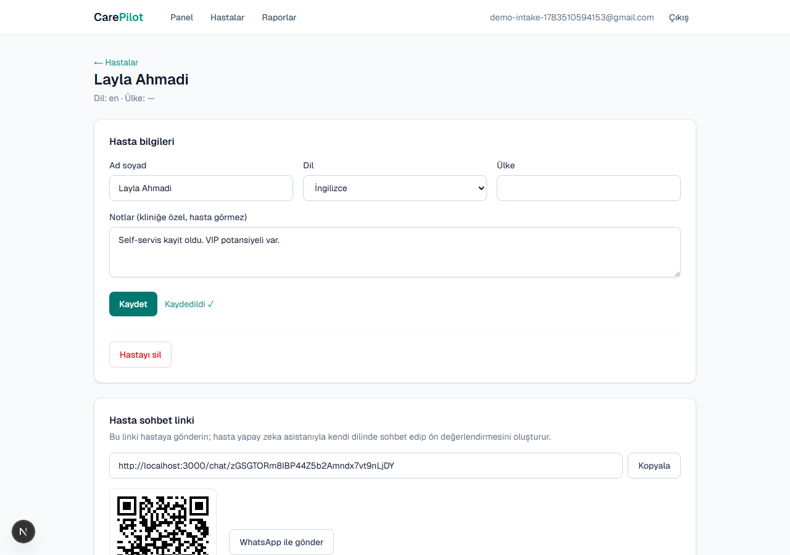 |

| AI ön değerlendirme (hasta detayı) | Rapor onay ekranı |
|---|---|
| 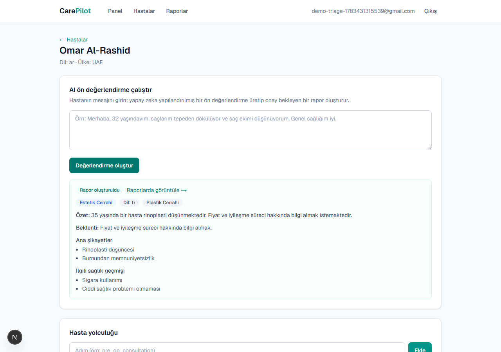 | 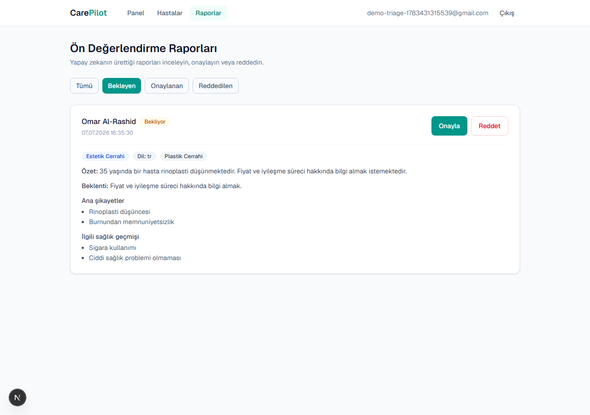 |

---

## 🔄 Sprint 1 — Tamamlandı (19 Haziran – 5 Temmuz)

### Sprint Notları
Bu sprintte projenin **çalışan iskeleti canlıya alındı**: FastAPI backend, JWT kimlik doğrulama, klinik/hasta/triage/yolculuk API'leri, ilk yapay zeka (Gemini) entegrasyonu, CI/CD ve Railway'e deploy. Backlog önceliklendirmesinde "önce çalışan uçtan uca bir dikey dilim" prensibi izlendi: kayıt → klinik → hasta → AI triage → onay zinciri baştan sona çalışır hale getirildi.

- **Sprint içinde tamamlanması tahmin edilen puan:** 100
- **Puan tamamlama mantığı:** Toplam ~300 puanlık ürün backlog'u 3 sprint'e bölündü; her sprint için ~100 puanlık iş hedeflendi. Sprint 1'de altyapı + ilk AI entegrasyonu bu bütçeyle tamamlandı.

### Daily Scrum
Proje tek geliştirici (solo) tarafından yürütüldüğü için günlük ilerleme; **conventional commit geçmişi** ve **sprint logları** üzerinden takip edildi. Akademi danışmanı ile iletişim grup kanalı üzerinden sağlandı.

### Sprint Board
Sprint 1 sonu board durumu:

| ✅ Done | 🔬 Test | 📋 To Do (Sprint 2) |
|---|---|---|
| Backend iskeleti (clean architecture) | 22/22 test geçti | Çok turlu hafızalı agent (LangGraph) |
| JWT auth (register/login/me) + rol-guard | ruff lint temiz | Hasta arayüzü (agent sohbeti) |
| Klinik/hasta/triage/yolculuk CRUD | CI (GitHub Actions) yeşil | Klinik panelinde rapor detay/onay ekranı |
| AI triage (Gemini 2.5 Flash) | Canlı uçtan uca doğrulama | Embedding tabanlı klinik eşleştirme |
| Alembic migration'ları (3) | | |
| Railway'e canlı deploy | | |
| Next.js klinik paneli (temel ekranlar) | | |

### Ürün Durumu
Yukarıdaki [Ekran Görüntüleri](#-ürün-durumu-ekran-görüntüleri) bölümüne bakınız. Backend ve frontend canlıda çalışır durumdadır.

### Sprint Review
**Ne çalışıyor:** Tüm backend canlıda. Auth, klinik/hasta yönetimi ve AI triage uçtan uca çalışıyor — gerçek Gemini çağrısıyla hasta mesajından yapılandırılmış rapor üretilip klinik onayına düşüyor. Frontend klinik paneli (kayıt/giriş/panel/hastalar) canlı backend'e bağlı. 22/22 test geçiyor, ruff temiz.

**Sprint Review katılımcıları:** Can Çorapçıoğlu (geliştirici).

**Bir sonraki faz için belirlenenler:** Çok turlu hafızalı agent, hasta arayüzü, klinik panelinde triage rapor detay/onay ekranları.

### Sprint Retrospective
- **İyi giden:** Plana kıyasla önde gidildi — deploy (Sprint 3 hedefiydi) ve frontend başlangıcı (Sprint 2) erken tamamlandı. Her adım testle ve canlı ortamda doğrulandı.
- **Geliştirilmesi gereken:** AI katmanı şu an tek turlu; hafızalı, çok turlu agent'a geçilmeli.
- **Sonraki sprint için aksiyon:** LangGraph ile hafızalı agent, hasta arayüzü ve klinik panelinde rapor onay ekranlarına odaklanmak.

---

## 🔄 Sprint 2 — Tamamlandı (6 Temmuz – 19 Temmuz)

### Sprint Notları
Bu sprintte ürünün **yapay zeka çekirdeği ve uçtan uca kullanıcı deneyimi** tamamlandı: tek seferlik triage yerine **çok turlu, hafızalı bir agent** (LangGraph) devreye alındı — hasta kendi dilinde sohbet ederek ön değerlendirmesini oluşturuyor. Hasta chat arayüzü, klinik rapor onay ekranları, self-servis davet linki (+QR) ve **embedding tabanlı anlamsal arama** eklendi.

- **Sprint içinde tamamlanması tahmin edilen puan:** 100
- **Puan tamamlama mantığı:** ~300 puanlık backlog'un ikinci dilimi (~100 puan) — hafızalı agent, hasta/klinik arayüzleri ve embedding eşleştirme bu sprintte tamamlandı.

### Daily Scrum
Solo geliştirici; günlük ilerleme conventional commit geçmişi ve sprint logları üzerinden takip edildi. Her özellik ayrı PR olarak açılıp gözden geçirilerek merge edildi.

### Sprint Board
Sprint 2 sonu board durumu:

| ✅ Done | 🔬 Test | 📋 To Do (Sprint 3) |
|---|---|---|
| Çok turlu hafızalı agent (LangGraph + PostgreSQL memory) | 34/34 test geçti | Ücretsiz hosting'e göç (canlıya alma) |
| Hasta AI sohbet arayüzü (`/chat/[token]`) | ruff lint temiz | Performans optimizasyonu |
| Klinik panelinde rapor detay + onay/ret ekranları | CI yeşil | 3 dakikalık demo videosu |
| Self-servis davet linki + QR + WhatsApp paylaşımı | Yerel + (Railway'de) canlı doğrulama | Son dokümantasyon |
| Hasta yönetimi (düzenle / not / silme) | | |
| Embedding tabanlı anlamsal arama (Gemini + pgvector) | | |

### Ürün Durumu
Yukarıdaki [Ekran Görüntüleri](#-ürün-durumu-ekran-görüntüleri) bölümündeki hasta sohbeti, self-servis davet ve hasta yönetimi ekranlarına bakınız.

### Sprint Review
**Ne çalışıyor:** Çok turlu hafızalı agent, hastayla kendi dilinde sohbet edip zorunlu tüm bilgileri toplayınca yapılandırılmış rapor üretiyor; klinik bu raporu panelde görüp onaylıyor. Self-servis davet linkiyle hastalar kendi kaydını yapıyor. Klinik doğal dille **anlamsal arama** yapıp (Gemini embedding + pgvector kosinüs benzerliği) en alakalı hasta raporlarını buluyor. 34/34 test geçiyor, ruff temiz.

**Sprint Review katılımcıları:** Can Çorapçıoğlu (geliştirici).

**Bir sonraki faz için belirlenenler:** Ürünü tekrar canlıya almak (Railway ücretsiz trial'ı dolduğu için ücretsiz bir alternatife göç), performans ve 3 dakikalık demo hazırlığı.

### Sprint Retrospective
- **İyi giden:** Sprint 2 kapsamının ötesine geçildi — self-servis davet, hasta yönetimi ve WhatsApp paylaşımı da eklendi. AI davranışı gerçek senaryolarla test edilip iyileştirildi (agent artık zorunlu bilgileri toplamadan sohbeti bitirmiyor).
- **Geliştirilmesi gereken:** Railway ücretsiz trial'ı doldu ve canlı ortam düştü; hosting sürdürülebilir/ücretsiz bir platforma taşınmalı.
- **Sonraki sprint için aksiyon:** Ücretsiz hosting'e göç (Neon Postgres + Render/Koyeb) veya Railway planı; ardından demo videosu ve son dokümantasyon.

## 🔄 Sprint 3 — Planlanan (20 Temmuz – 2 Ağustos)
- Ürünü tekrar canlıya alma (Railway trial bittiği için ücretsiz alternatife göç: Neon + Render/Koyeb)
- Performans optimizasyonu ve son rötuşlar
- 3 dakikalık demo videosu
- Dokümantasyonun tamamlanması

---

## ⚙️ Kurulum

Ayrıntılı backend kurulumu için [backend/README.md](./backend/README.md), ürün gereksinimleri için [PRD.md](./PRD.md).

```bash
# Backend
cd backend
python -m venv .venv && source .venv/Scripts/activate
pip install -r requirements.txt
cp .env.example .env            # GEMINI_API_KEY ve diğer değerleri doldur
docker compose up -d db         # (kök dizinden) PostgreSQL
alembic upgrade head
uvicorn app.main:app --reload   # http://localhost:8000/docs

# Frontend
cd frontend
npm install
npm run dev                      # http://localhost:3000
```

---

## ⚖️ Etik ve Yasal Sınırlar

> **CarePilot'un AI agent'ı kesinlikle tıbbi tanı veya tedavi tavsiyesi vermez.**

Agent yalnızca bilgi toplar, yapılandırır ve klinik onayına sunar; nihai tıbbi karar her zaman yetkili sağlık profesyoneline aittir. Bu sınır sistem promptunda ve arayüzde açıkça belirtilir. Hasta sağlık verisi KVKK kapsamında özel nitelikli kişisel veri sayılır ve buna uygun ele alınır.
